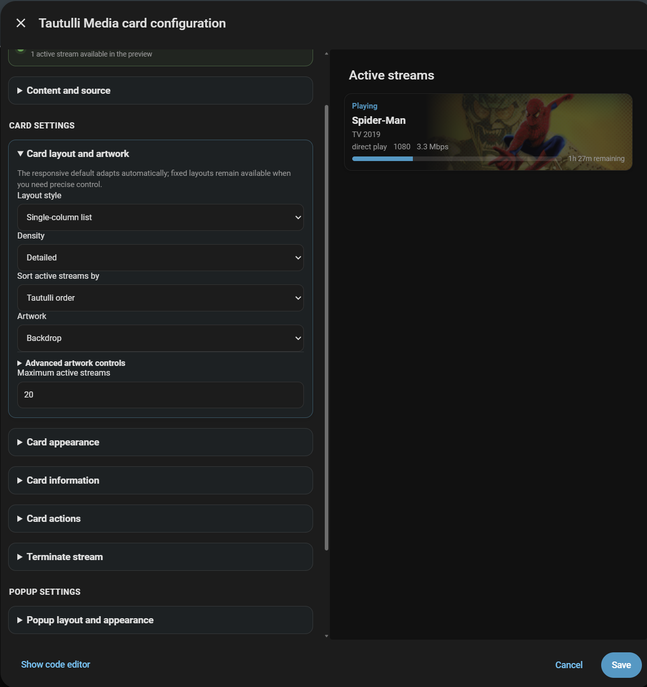
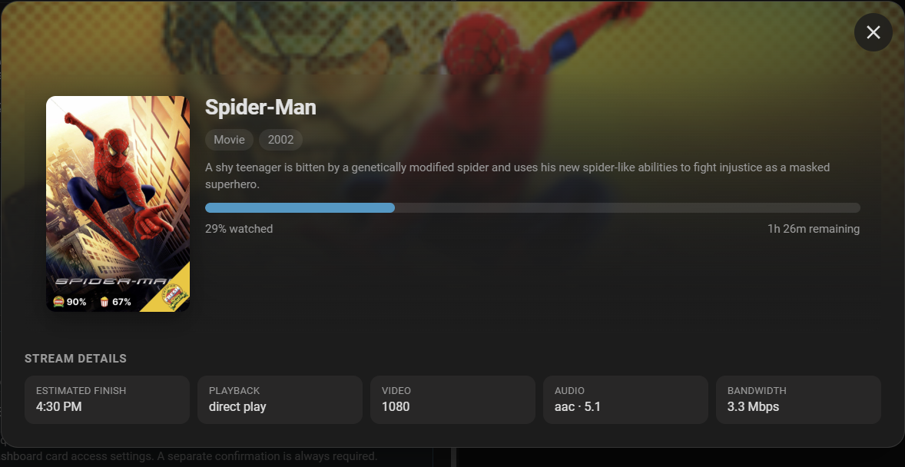

# Tautulli Active Streams Card

A native, responsive Home Assistant dashboard card for the [Tautulli Active Streams integration](https://github.com/Richardvaio/Tautulli_Active_Streams). It replaces the original multi-card YAML layout with one dependency-free card and a guided visual editor.



The guided editor keeps card and popup settings separate while showing changes in a live preview.



It requires **Tautulli Active Streams 2.7.0 or newer**.

## Features

- Active Plex streams with artwork, playback state, progress, users, clients, quality, bandwidth and remaining time.
- Recently added Plex media with library and media-type filters.
- Popular and top movies, television and music using Tautulli statistics.
- Privacy-safe Plex user activity summaries.
- Administrator-only, paginated watch history when enabled in the integration.
- Classic, modern, minimal and cinematic presentation options.
- Responsive grid, list, vertical stack, carousel, auto-scrolling marquee and showcase layouts.
- Poster/cover, backdrop, combined poster-with-backdrop and artwork-free treatments.
- Configurable headers, counts, fields, colours, spacing, progress bars and artwork sizing.
- Detailed popup with configurable summary and reorderable stream-detail fields.
- Optional administrator-only stream termination with a separate confirmation dialog.
- Graceful loading, empty, stale and unavailable states.
- Visual editor support; no YAML is required for normal setup.

The card uses only Home Assistant's authenticated WebSocket and signed image endpoints. It never connects directly to Tautulli or Plex and never receives their credentials, IP addresses, filesystem paths or raw upstream payloads.

## Requirements

- Home Assistant with HACS installed.
- [Tautulli Active Streams integration](https://github.com/Richardvaio/Tautulli_Active_Streams) version 2.7.0 or newer.
- A configured and loaded Tautulli Active Streams entry.

No additional dashboard cards are required.

## Installation with HACS

1. Install or update **Tautulli Active Streams** to version 2.7.0 or newer.
2. Restart Home Assistant.
3. Open **HACS** and choose **Custom repositories** from the menu.
4. Add `https://github.com/Richardvaio/tautulli-active-streams-card` as a **Dashboard** repository.
5. Download **Tautulli Active Streams Card**.
6. Refresh the browser. A hard refresh may be required after an update.

HACS adds the JavaScript resource automatically. If the card is not visible after installation, confirm that `/hacsfiles/tautulli-active-streams-card/tautulli-active-streams-card.js` appears under **Settings → Dashboards → Resources**.

## Manual installation

1. Download `tautulli-active-streams-card.js` from the release.
2. Copy it to `<config>/www/tautulli-active-streams-card.js`.
3. Add `/local/tautulli-active-streams-card.js` as a **JavaScript module** under **Settings → Dashboards → Resources**.
4. Refresh the browser.

## Add the card

1. Edit a Home Assistant dashboard.
2. Select **Add card**.
3. Search for **Tautulli Media Card**.
4. Select a Tautulli server, choose a content view and adjust the presentation in the visual editor.

Minimal YAML remains available:

```yaml
type: custom:tautulli-media-card
entry_id: YOUR_CONFIG_ENTRY_ID
mode: active
```

The editor normally selects the only compatible Tautulli entry automatically.

## Content views

### Active streams

Displays current movie, television, live-video and music sessions. Choose all media, video only or music only, then configure sorting, visible information, progress styling and popup details.

### Recently added

Displays recently added Plex media with server-provided library and media-type filters. Television additions can remain as individual items or be grouped by show or season.

### Popular media

Displays Tautulli home statistics by plays or duration over a selectable period. Available rankings depend on the connected server's capabilities.

### Plex user activity

Displays privacy-safe aggregate activity for Plex users. User names and client detail remain subject to the integration's server-side dashboard access settings.

### Watch history

Displays a bounded, paginated history view. It requires a Home Assistant administrator and **Allow administrators to view watch history in cards** in the integration options.

## Layouts

Every content view (active streams, recently added, popular and top media, user activity) supports the same layout modes, configured in the editor under **Card layout and appearance**:

- **Responsive grid** — columns with per-mode density.
- **Single-column list** — full-width rows.
- **Vertical stack** — compact, tight-spacing rows for media views.
- **Poster shelf / carousel** — horizontal shelf with scroll snap and optional arrows.
- **Auto-scrolling shelf (marquee)** — a GPU-composited infinite glide. Configure speed (slider), direction, item spacing and how much of the next item peeks in. Touching or dragging the strip stops the glide and tracks your finger 1:1; releasing resumes scrolling from the exact position. Opening a popup pauses it; closing resumes.
- **Showcase** — one item at a time with scroll-snap, swipe gestures, auto-advance every few seconds (also paused while a popup is open) and optional previous/next buttons. Loops seamlessly.

With fewer than two unique items the marquee and showcase render a single static card — no scrolling, no duplicated slides.

## Visual editor

The editor separates dashboard-card settings from popup settings and keeps sections collapsed until needed. Settings that do not apply to the selected view are hidden automatically.

- **Content and source** selects the Tautulli server and view.
- **Card layout and appearance** combines presets, layout, columns, density, artwork, background and optional fine-tuning in one relevant section.
- **General** controls the header, item count, empty state and animations.
- **Stream information** (active streams) groups the visible fields into collapsible sub-sections: identity, media details, playback and progress, and quality and bandwidth.
- **Tap behaviour** controls what happens when an item is tapped.
- **Popup settings** controls popup appearance, width, open animation, summaries, progress and ordered detail fields.
- **Terminate stream** appears only for compatible active-stream actions.
- **Fine-tune colours and sizing** exposes current values, unit-aware sizing controls and restore-to-style-default behaviour.
- **Reset all settings to defaults** restores the card configuration while keeping the selected server.

Classic artwork defaults to 85px wide. Artwork retains its source aspect ratio and uses the selected crop or contain treatment without stretching.

## Details popup

The optional popup can show artwork, summary, Plex user, progress, remaining time, estimated finish, paused duration, client, device, playback decision, video/audio quality, bandwidth, media metadata and ratings. Stream-detail fields can be reordered by dragging their handles in the editor.

### Popup animation and background

- **Open animation** — none, fade in, scale up, or rise from below (a bottom-sheet slide), with an independent open duration. Closing plays the same animation in reverse, at its own configurable close duration (default 200ms).
- **Dim background** — darkens the whole screen behind the popup.
- **Blur background** — applies a frosted blur to the background behind the popup.
- **Popup background** — overrides the popup surface colour with a theme variable, colour or `rgba()` value.
- **Backdrop art strength** (cinematic appearance only) — controls how strongly the backdrop art renders inside the popup.

While a popup is open, the dashboard behind it does not scroll. On touch devices, taps open the popup once without ghost-click double triggering, and tapping the backdrop closes it.

The popup is responsive on narrow screens: the Plex user moves below the title, long text wraps instead of scrolling sideways, and dialog buttons use comfortable touch targets.

Paused duration is updated every second in the browser between integration polls. Paused and buffering states use distinct, theme-aware status colours.

## Stream termination

Termination is disabled by default and requires all of the following:

1. The signed-in Home Assistant account is an administrator.
2. **Allow administrators to terminate streams from cards** is enabled under the integration's **Dashboard card access** settings.
3. **Show terminate-stream action** is enabled in the card editor.

The action can appear in the popup, on the main card, or both. The popup action can use an icon or labelled button in a configurable position. A separate confirmation dialog is always required, and the details popup remains behind the confirmation until it is closed or the stream ends.

## Responsive and accessible behaviour

- Layout responds to the card's available dashboard width using container queries.
- Carousel views support touch scrolling, scroll snap, keyboard focus and desktop controls.
- Popups trap keyboard focus and close with Escape.
- Interactive controls retain visible focus states and touch-friendly sizes.
- Reduced-motion preferences disable pulse, shimmer and smooth-scroll animation.
- Temporary server failures retain cached content with a subtle stale indication.
- Initial loading and unavailable integrations never expose raw WebSocket errors.

## Troubleshooting

### The card is not listed

- Confirm the JavaScript resource exists under **Settings → Dashboards → Resources**.
- Refresh the browser or clear its frontend cache.
- Confirm the resource type is **JavaScript module**.

### No compatible server appears

- Install Tautulli Active Streams 2.7.0 or newer.
- Restart Home Assistant after updating the integration.
- Confirm the integration entry is loaded and can reach Tautulli.

### A view or action is missing

The editor only offers capabilities allowed by the integration. Open **Settings → Devices & services → Tautulli Active Streams → Configure → Dashboard card access** and review its privacy and administrator permissions.

### Artwork does not update after upgrading

Perform a hard browser refresh. HACS and Home Assistant cache frontend modules aggressively.

## Development

```bash
pnpm install
pnpm check
pnpm test
pnpm build
```

The HACS-compatible bundle is generated at `dist/tautulli-active-streams-card.js`. Automated validation checks TypeScript, ESLint, component tests, the committed production bundle and HACS dashboard structure.

## Support and contributing

Use the [GitHub issue tracker](https://github.com/Richardvaio/tautulli-active-streams-card/issues) for bug reports and feature requests. Include the card version, integration version, Home Assistant version and a privacy-safe description of the configuration involved.

Pull requests are welcome.

## License

This project is licensed under the [MIT License](LICENSE).
